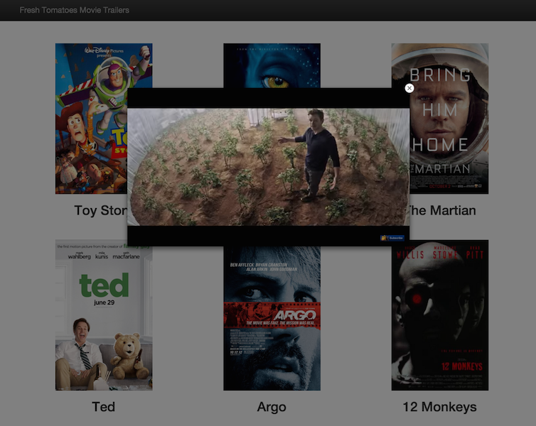

# Udacity Fullstack Nanodegree Movie Trailer Website Project
---
### How to Start

Clone this repository onto your machine and open the movie trailer website:

```
    $> git clone https://github.com/cg94301/fullstack-nanodegree-movie-portfolio.git
    $> cd fullstack-nanodegree-movie-portfolio
    $> python entertainment_center.py
```

You should see a collection of movie trailers. 

### Information on Movie
Click on the movie poster to start the movie trailer.

### Movie Portfolio Site

